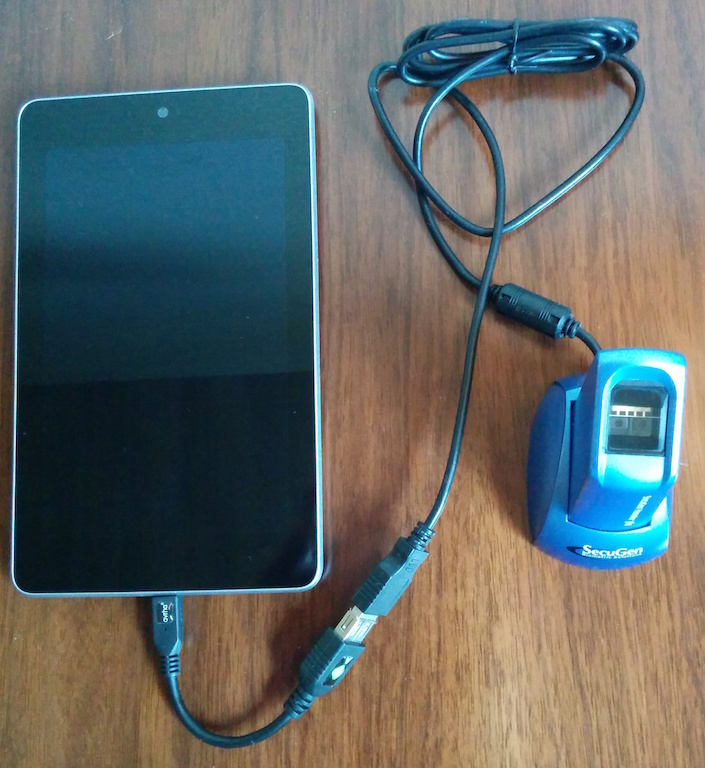
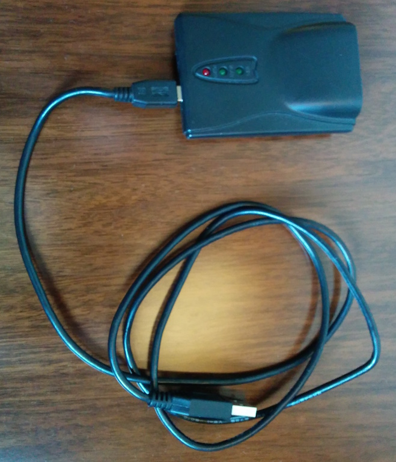
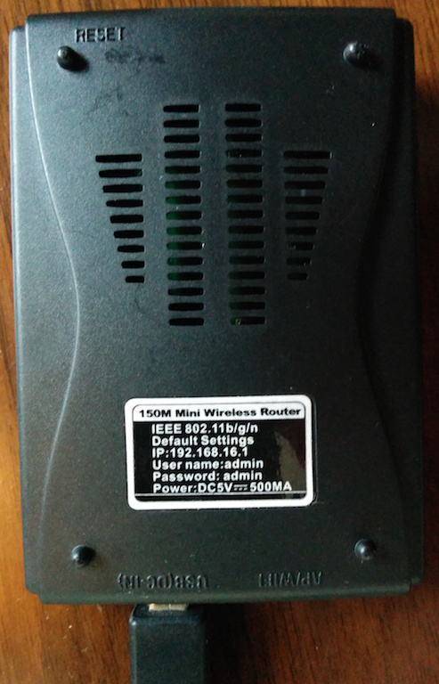

# Equipment Setup for Developing Kiwi

The [Secugen Hamster Plus](http://www.secugen.com/products/php.htm) is connected to the [Nexus 7 (2012 model)](http://en.wikipedia.org/wiki/Nexus_7_%282012_version%29) using a USB OTG adapter similar to [this one](http://www.amazon.com/StarTech-com-5in-Micro-Host-Adapter/dp/B00B4GGW5Q/ref=sr_1_1?ie=UTF8&qid=1411284659&sr=8-1&keywords=micro-usb+to+usb+connector).

It has been extremely convenient to use a mini wireless router for ADB debugging over USB and installing the app to the tablets. I'm using a [Neewer 150M mini Pocket Wireless Router 802.11b/g/n](http://www.amazon.com/Neewer-Pocket-Wireless-Router-802-11b/dp/B005IJPZXK/ref=pd_sxp_f_pt).

Front:

Back:
